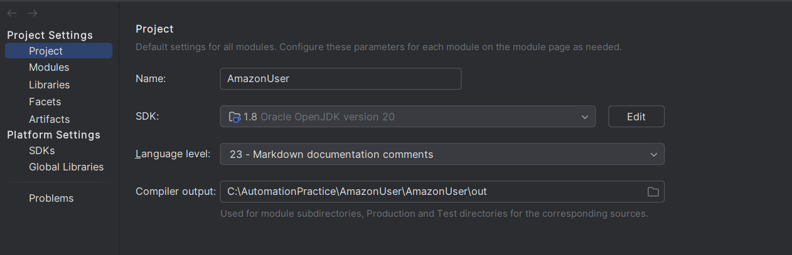
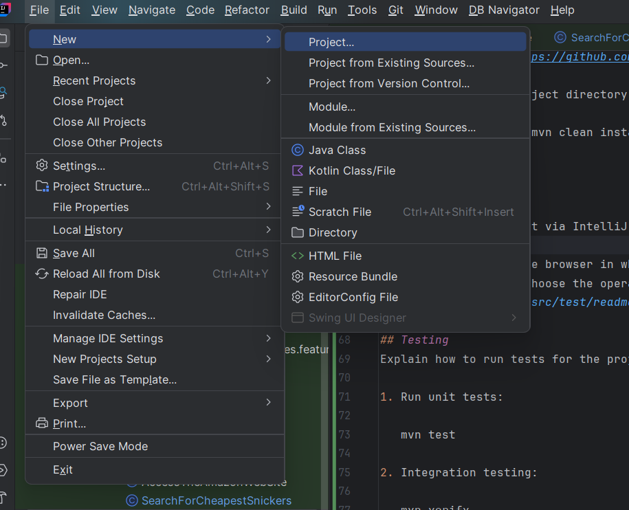
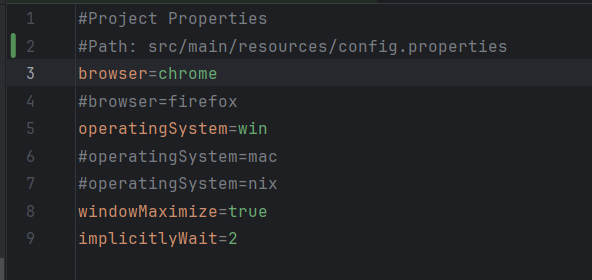
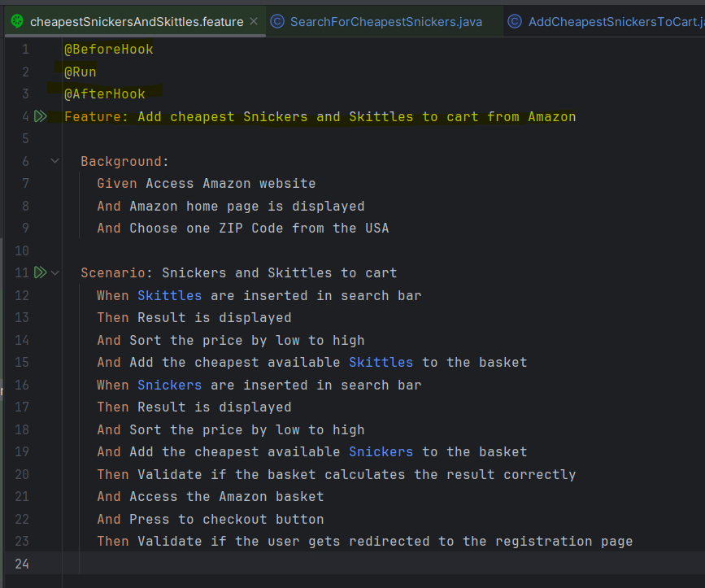

# amazon-user-items-manipulations

*This project is a cross-platform web testing solution designed for automated testing across multiple operating systems (Windows, Linux, MacOS) and browsers (Google Chrome and Firefox).*

Key Achievements:
1. Provided a comprehensive setup guide (Readme.md) to streamline customer onboarding.
2. Used Cucumber-compatible language for clear and detailed test reporting.
3. Followed the DRY principle to facilitate easy expansion of the test suite.
4. Enabled support for multiple OS drivers (Windows, Linux, MacOS).*
---
  

## Table of Contents
1. [Overview](#overview)
2. [Features](#features)
3. [Configuration](#configuration)
4. [Testing](#testing)
5. [Contact](#contact)

---

## Overview
The automation tests simulate an Amazon purchase flow for a new user, including steps to search for the most affordable Snickers and Skittles, add them to the cart, and confirm that the total price is calculated correctly. During the checkout process, the test ensures that users without an account are prompted to register.
Key dependencies and technologies used:
1. Design patterns: Single Tone, Factory Method, Abstract Factory,etc.
2. Core Language & Framework:
   Java: was chosen due to its versatility and compatibility with Selenium.
   Cucumber: Enables Behavior-Driven Development (BDD) by using Gherkin syntax to create human-readable test cases. It also allows tests to be documented in a descriptive language that’s exportable for automated reporting.
3. Web Automation Tool:
   Selenium WebDriver: The main driver for browser automation in this project. Selenium WebDriver supports multiple browsers and can easily be configured for Chrome.
   WebDriverManager: For dynamic browser driver management, ensuring that the latest drivers for Chrome, Firefox, Edge, Safari, etc., are available without manual setup.
4. Browser and Platform Compatibility:
      Cross-Browser Support: Selenium WebDriver will manage this, allowing tests to run on different browsers, including Chrome, Firefox, Safari, and Edge.
      Cross-Platform Support: You would configure the framework to work on Windows, macOS, and Linux by including necessary WebDriver binaries and potentially using WebDriverManager to fetch the correct driver versions.
5. Test Execution:
   JUnit/TestNG: To organize and run test suites.
---
## Features
- *cheapestSnickersAndSkittles.feature*:
  This feature adds the cheapest Snickers and Skittles to the cart on Amazon, verifies cart calculations, and checks redirection to the registration page at checkout.

### Prerequisites
- *Java*: Version 1.8.
- *JDK*: Version 20.

- *Maven*: Dependency manager.
- *IntelliJ IDEA*: Installed on our local machine.
---
### Steps to clone the framework from repository to your local machine
1. Clone the repository:

   #### *git init - Initialize your local repository on your local machine.*
   #### *git clone https://github.com/VadimPasat/amazon-user-items-manipulations.git*

2. Navigate to the project directory: cd amazon-user-items-manipulations

3. Build the project: mvn clean install
---

## Configuration
#### Open the cloned project via IntelliJ IDEA:

#### Access the config.properties file and select the operating system and browser driver for running the test scenario:
- *browser*: Choose the browser in which the test will be executed.
- *operatingSystem*: Choose the operating system on which the test will be executed.

## Testing
Explain how to run tests for the project.

1. Run unit tests:

   mvn test

2. Integration testing:

   mvn verify
---
### Run Tests

Click on the feature file you want to run, then select Run Tests. By default, tests will run on Windows with the Chrome driver.

The test also can be started with AtfRunner class if the feature file have the folowing tags:
1. @BeforeHook
2. @Run
3. @AfterHook

---
## Contact
If you have any questions, feel free to contact the maintainers:
- *Vadim* - [fanykular@example.com](mailto:your.email@example.com)
- Or open an issue in the repository
---